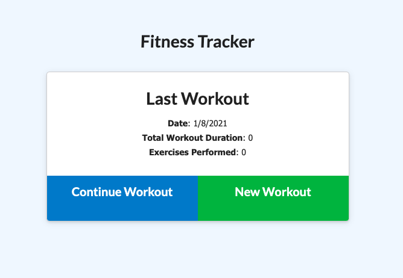
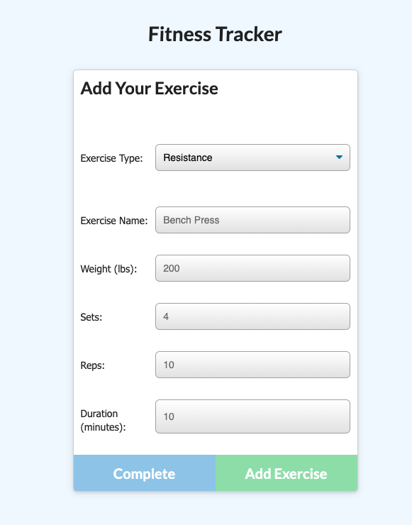
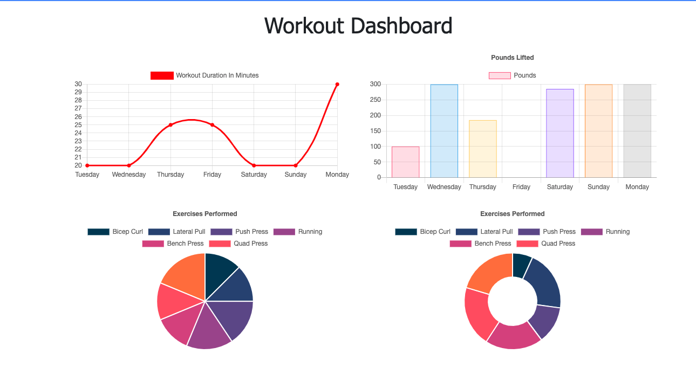

# **HW17-workout-tracker**


## **Table of Contents**

* [Description](#Description)
* [Installation](#Installation)
* [Screenshots](#Screenshots)
* [Contributing](#Contributing)
* [Tests](#Tests)
* [License](#License)
* [Questions](#Questions)

## **Description**
The purpose of this assignment add a backend to a functional workout tracker.  WE had to create a Mongo database with a Mongoose schema as well as handle routes with Express.  The user should be able to input the various workouts they have completed and then see a visual represnetation of the previous seven workouts.  

What I think helped me greatly was taking the time to review the given code before I actually started to fill in the gaps.  Even though we didn't really use or have to worry about the documents too much. I found it much more helpful to know exactly what the app does (or in this case, should do) before going in to fix it.

Live link: https://hwseventeen-workout-tracker.herokuapp.com/


## **Installation**
1. Clone the repo
```sh
https://github.com/AWSiegfried/HW17-workout-tracker.git
```

2. Install NPM packages
```sh
npm install
```

## **Screenshot**





## **Contributing**

Please feel free to contribute to this repo! Emails are appreciated (email address below) but even then, hopefully it just helps you out!


## **Tests**

Test your library
```sh
npm test
```

## **License**

This repository is covered under the MIT license. 

## **Questions**
Please contact with any questions or thoughts.
Email: awsiegfried@gmail.com

Check out [my GitHub](https://github.com/AWSiegfried)
